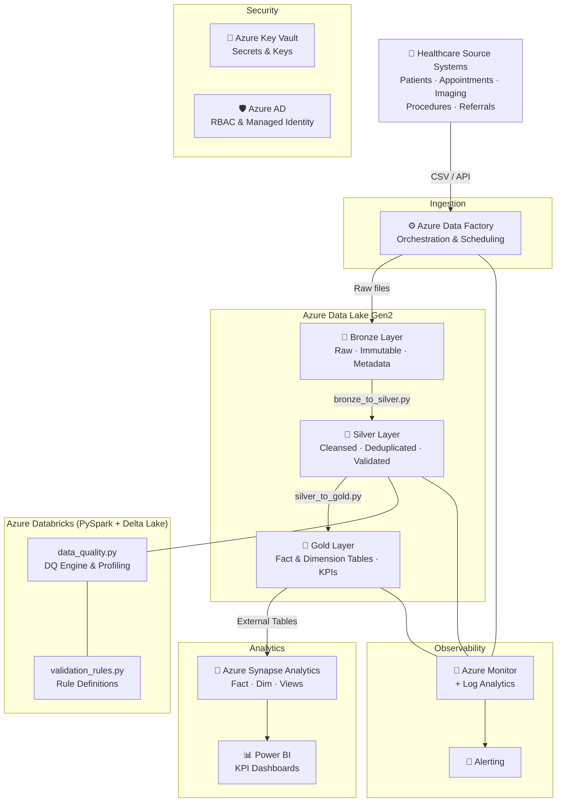

# azure-healthcare-analytics-platform# 🏥 Azure Healthcare Analytics Platform

> **Enterprise-grade Azure Data Engineering platform for NHS hospital analytics.**  
> Ingests healthcare data, processes it through Medallion Architecture (Bronze → Silver → Gold), applies data quality rules, stores data in Delta Lake, serves analytics through Azure Synapse, and visualises KPIs in Power BI.

[](https://github.com/your-org/azure-healthcare-analytics/actions)
[](https://www.terraform.io)
[](https://www.python.org)
[](https://spark.apache.org)
[](https://delta.io)
[](LICENSE)

---

## 📋 Table of Contents

1. [Business Case](#-business-case)
2. [Architecture](#-architecture)
3. [Technology Stack](#-technology-stack)
4. [Project Structure](#-project-structure)
5. [Medallion Architecture](#-medallion-architecture)
6. [Data Model](#-data-model)
7. [Quick Start — Run Locally](#-quick-start--run-locally)
8. [Deploy to Azure](#-deploy-to-azure)
9. [Push to GitHub](#-push-to-github)
10. [CI/CD Pipeline](#-cicd-pipeline)
11. [Security Design](#-security-design)
12. [Monitoring](#-monitoring)
13. [Power BI Dashboard](#-power-bi-dashboard)
14. [Data Quality](#-data-quality)
15. [Cost Optimisation](#-cost-optimisation)
16. [Disaster Recovery](#-disaster-recovery)
17. [Future Enhancements](#-future-enhancements)

---

## 💼 Business Case

NHS hospitals generate millions of records daily from patient registration, appointments, imaging, referrals, laboratory, and procedure systems. This platform addresses three core challenges:

| Challenge | Solution |
|-----------|----------|
| Fragmented source systems with no unified analytics layer | Centralised Azure Data Lake with Medallion Architecture |
| Poor data quality — duplicates, nulls, invalid values | Automated DQ framework with rule-based validation and alerting |
| No self-service reporting for clinicians and management | Azure Synapse + Power BI with pre-built KPI dashboards |

**Scale target:** 10M+ records/day across 5 data domains.

---

## 🏗 Architecture



---

## 🛠 Technology Stack

| Layer | Technology |
|-------|------------|
| Ingestion | Azure Data Factory |
| Storage | Azure Data Lake Storage Gen2 |
| Processing | Azure Databricks + PySpark |
| Table Format | Delta Lake |
| Serving | Azure Synapse Analytics |
| Visualisation | Power BI |
| Security | Azure Key Vault, Azure AD, Managed Identity |
| IaC | Terraform |
| CI/CD | GitHub Actions |
| Testing | PyTest |
| Monitoring | Azure Monitor + Log Analytics |

---

## 📁 Project Structure

```
azure-healthcare-analytics/
├── .github/
│   └── workflows/
│       └── ci-cd.yml               # GitHub Actions pipeline
├── databricks/
│   └── notebooks/
│       ├── bronze_to_silver.py     # Bronze → Silver transformation
│       ├── silver_to_gold.py       # Silver → Gold (Fact/Dim/KPIs)
│       ├── data_quality.py         # DQ Engine
│       └── validation_rules.py     # Rule definitions
├── docs/
│   ├── security.md                 # Security architecture
│   ├── cost_optimisation.md        # Cost guidance
│   └── disaster_recovery.md        # DR runbook
├── monitoring/
│   └── log_analytics_queries.kql  # KQL monitoring queries
├── pipelines/
│   └── adf/
│       └── pl_ingest_healthcare_bronze.json
├── powerbi/
│   └── dashboard_spec.md           # Dashboard requirements + DAX
├── sample-data/
│   ├── generate_data.py            # Synthetic data generator
│   ├── patients.csv
│   ├── appointments.csv
│   ├── imaging.csv
│   ├── procedures.csv
│   └── referrals.csv
├── sql/
│   ├── synapse/
│   │   └── create_tables.sql       # Fact + Dim DDL
│   └── views/
│       └── analytics_views.sql     # Analytics views
├── terraform/
│   ├── main.tf
│   ├── variables.tf
│   ├── outputs.tf
│   └── modules/
│       ├── storage/main.tf
│       ├── network/main.tf
│       ├── databricks/main.tf
│       ├── synapse/main.tf
│       ├── keyvault/main.tf
│       └── monitoring/main.tf
├── tests/
│   ├── unit/
│   │   └── test_validation_rules.py
│   └── integration/
│       └── test_pipeline.py
├── requirements-dev.txt
└── README.md
```

---

## 🥉🥈🥇 Medallion Architecture

### Bronze Layer — Raw Ingestion
- **Purpose:** Immutable copy of source data exactly as received
- **Format:** Parquet / Delta (append-only)
- **Metadata added:** `_ingestion_timestamp`, `_source_system`, `_pipeline_run_id`
- **Retention:** Indefinite (raw audit trail)

### Silver Layer — Cleansed & Validated
- **Deduplication:** Window function `ROW_NUMBER()` over primary key + timestamp
- **Standardisation:** Gender, department, modality, postcode normalisation
- **Null handling:** Flagged with `dq_*_null` indicator columns
- **Date validation:** Invalid/future dates flagged and cast safely
- **Delta MERGE:** Upserts ensure idempotent processing
- **Partitioning:** By date dimension for query performance

### Gold Layer — Business Ready
- **DimPatient:** Enriched with age, age band
- **DimDepartment:** With department group classification
- **DimDate:** Full calendar + NHS financial year
- **FactPatientActivity:** Unified activity fact across all domains
- **KPI aggregates:** Pre-computed monthly metrics for Power BI

---

## 📐 Data Model

```
patients          appointments        imaging
-----------       -------------       -------
patient_id (PK)   appointment_id (PK) imaging_id (PK)
gender            patient_id (FK)     patient_id (FK)
date_of_birth     appointment_date    modality
postcode          department          scan_date
                  status

procedures        referrals
----------        ---------
procedure_id (PK) referral_id (PK)
patient_id (FK)   patient_id (FK)
procedure_type    referral_date
cost              speciality
```

---

## 🚀 Quick Start — Run Locally

### Prerequisites
- Python 3.9+
- Java 11 (required by PySpark)
- Git

### 1. Clone the repository
```bash
git clone https://github.com/your-org/azure-healthcare-analytics.git
cd azure-healthcare-analytics
```

### 2. Create a virtual environment
```bash
python -m venv .venv

# Windows
.venv\Scripts\activate

# macOS / Linux
source .venv/bin/activate
```

### 3. Install dependencies
```bash
pip install -r requirements-dev.txt
```

### 4. Generate synthetic data
```bash
cd sample-data
python generate_data.py
cd ..
```

This creates:
- `patients.csv` (1,000 rows)
- `appointments.csv` (5,050 rows — with ~1% duplicate records for DQ testing)
- `imaging.csv` (2,000 rows)
- `procedures.csv` (1,500 rows)
- `referrals.csv` (2,500 rows)

### 5. Run unit tests (no Azure required)
```bash
pytest tests/unit/ -v
```

### 6. Run integration tests (local Spark + Delta Lake)
```bash
pytest tests/integration/ -v
```

### 7. Run integration tests with coverage
```bash
pytest tests/ -v --cov=databricks --cov-report=html
open htmlcov/index.html
```

---

## ☁️ Deploy to Azure

### Prerequisites
- Azure CLI: `az login`
- Terraform 1.6+
- Contributor role on target subscription

### Step 1 — Bootstrap Terraform state storage
```bash
az group create -n rg-healthcare-tfstate -l uksouth
az storage account create -n sahealthcaretfstate -g rg-healthcare-tfstate -l uksouth --sku Standard_LRS
az storage container create -n tfstate --account-name sahealthcaretfstate
```

### Step 2 — Create `terraform.tfvars`
```hcl
# terraform/terraform.tfvars
subscription_id      = "YOUR_SUBSCRIPTION_ID"
tenant_id            = "YOUR_TENANT_ID"
environment          = "dev"
location             = "uksouth"
synapse_sql_password = "YourSecurePassword123!"
```

### Step 3 — Deploy infrastructure
```bash
cd terraform
terraform init
terraform plan -out=tfplan
terraform apply tfplan
```

Terraform creates:
- Resource group
- ADLS Gen2 with 6 containers (bronze/silver/gold/raw/checkpoints/monitoring)
- Azure Databricks workspace (VNet injected)
- Azure Synapse Analytics workspace + SQL Pool
- Azure Key Vault
- Log Analytics + Application Insights

### Step 4 — Upload notebooks to Databricks
```bash
pip install databricks-cli
databricks configure --token   # Enter workspace URL and PAT
databricks workspace import_dir databricks/notebooks /Shared/healthcare --overwrite
```

### Step 5 — Upload sample data to ADLS
```bash
STORAGE_ACCOUNT=$(terraform -chdir=terraform output -raw storage_account_name)
az storage blob upload-batch \
  --account-name $STORAGE_ACCOUNT \
  --destination raw \
  --source sample-data/ \
  --pattern "*.csv"
```

### Step 6 — Import ADF pipeline
```bash
# In Azure Portal → Data Factory → Manage → Import ARM template
# Or use Azure CLI:
az datafactory pipeline create \
  --resource-group rg-healthcare-dev \
  --factory-name adf-healthcare-dev \
  --name pl_ingest_healthcare_bronze \
  --pipeline @pipelines/adf/pl_ingest_healthcare_bronze.json
```

### Step 7 — Create Synapse tables
Connect to Synapse SQL Pool and run:
```bash
sqlcmd -S synw-healthcare-dev.sql.azuresynapse.net \
       -d HealthcareAnalytics \
       -i sql/synapse/create_tables.sql
sqlcmd -S synw-healthcare-dev.sql.azuresynapse.net \
       -d HealthcareAnalytics \
       -i sql/views/analytics_views.sql
```

### Step 8 — Trigger the pipeline
In Azure Data Factory, trigger `pl_ingest_healthcare_bronze` manually or set a daily schedule.

---

## 📤 Push to GitHub

```bash
# 1. Initialise git (if not already)
git init
git add .
git commit -m "feat: initial Azure Healthcare Analytics Platform"

# 2. Create repository on GitHub (via UI or CLI)
gh repo create azure-healthcare-analytics --public --push

# OR link to existing repo
git remote add origin https://github.com/YOUR_USERNAME/azure-healthcare-analytics.git
git branch -M main
git push -u origin main
```

### Configure GitHub Secrets
In your repository: **Settings → Secrets and variables → Actions**

| Secret Name           | Value |
|-----------------------|-------|
| `ARM_CLIENT_ID`       | Service principal App ID |
| `ARM_CLIENT_SECRET`   | Service principal secret |
| `ARM_SUBSCRIPTION_ID` | Azure subscription ID |
| `ARM_TENANT_ID`       | Azure AD tenant ID |
| `SYNAPSE_SQL_PASSWORD`| Synapse SQL admin password |
| `DATABRICKS_HOST_DEV` | Databricks workspace URL |
| `DATABRICKS_TOKEN_DEV`| Databricks PAT token |

The CI/CD pipeline then automatically:
- Runs tests on every PR
- Deploys to `dev` on merge to `develop`
- Deploys to `test` on merge to `main`
- Deploys to `prod` on manual trigger with approval

---

## 🔄 CI/CD Pipeline

```
PR Opened          Push to develop     Push to main        Manual trigger
     │                   │                  │                    │
     ▼                   ▼                  ▼                    ▼
[Unit Tests]       [Unit Tests]       [Unit Tests]         [Unit Tests]
[TF Validate]      [TF Validate]      [TF Validate]        [TF Validate]
                   [Deploy Dev]       [Deploy Dev]         [Deploy Prod]
                                      [Deploy Test]        (requires approval)
```

---

## 🔐 Security Design

See [docs/security.md](docs/security.md) for full details.

| Control | Implementation |
|---------|----------------|
| Authentication | Azure AD + Managed Identity (no passwords in code) |
| Authorisation | RBAC — Reader/Contributor/Owner per environment |
| Secrets | Azure Key Vault — no secrets in config files |
| Network | VNet injection, Private Endpoints, NSGs |
| Encryption at rest | AES-256 (Azure default) |
| Encryption in transit | TLS 1.2+ enforced |
| Audit | Azure Monitor + Log Analytics |
| Data masking | Synapse Dynamic Data Masking on PII columns |

---

## 📡 Monitoring

See [monitoring/log_analytics_queries.kql](monitoring/log_analytics_queries.kql).

| Alert | Condition | Severity |
|-------|-----------|----------|
| Pipeline failure | Any ADF/Databricks failure | High |
| DQ failure rate | >5% DQ failures in 1 hour | Medium |
| SQL Pool CPU | >85% for >15 min | High |
| Storage latency | P99 > 500ms | Medium |

---

## 📊 Power BI Dashboard

See [powerbi/dashboard_spec.md](powerbi/dashboard_spec.md) for:
- Full page layouts
- All DAX measures
- Data source connection instructions
- Relationship model

---

## 💰 Cost Optimisation

See [docs/cost_optimisation.md](docs/cost_optimisation.md).

Key strategies:
- **Databricks:** Auto-scaling clusters, spot instances for non-critical jobs
- **Synapse SQL Pool:** Auto-pause after 15 minutes idle (saves ~65% in dev)
- **Storage:** Delta `OPTIMIZE` + `VACUUM` to reduce small files and outdated snapshots
- **Reserved Instances:** 1-year reservation for Databricks DBUs saves ~40%
- **Partitioning:** Date-based partitioning reduces data scanned per query

---

## 🔁 Disaster Recovery

See [docs/disaster_recovery.md](docs/disaster_recovery.md).

| Component | RPO | RTO | Strategy |
|-----------|-----|-----|----------|
| ADLS Gen2 | 1h (prod GRS) | 4h | Geo-redundant replication |
| Delta Lake | 1h | 2h | Delta time-travel + VACUUM retention |
| Synapse | 8h | 24h | Automatic restore points |
| Databricks | N/A (stateless) | 1h | Notebook re-deploy via CI/CD |
| Key Vault | Near-zero | 1h | Soft-delete + Purge protection |

---

## 🔮 Future Enhancements

- [ ] **Real-time streaming** — Azure Event Hubs + Spark Structured Streaming for live appointment alerts
- [ ] **ML layer** — No-show prediction model (MLflow + Azure ML)
- [ ] **Data Mesh** — Domain-oriented data products per clinical domain
- [ ] **Unity Catalog** — Centralised data governance and lineage
- [ ] **FHIR integration** — HL7 FHIR R4 API for interoperability with EPR systems
- [ ] **Synthetic data expansion** — Lab results, prescriptions, discharge summaries
- [ ] **Cost allocation** — Chargeback reporting per department/specialty

---

## 👥 Contributing

1. Fork the repository
2. Create a feature branch (`git checkout -b feature/my-feature`)
3. Commit your changes (`git commit -m 'feat: add my feature'`)
4. Push to the branch (`git push origin feature/my-feature`)
5. Open a Pull Request

---

---

*Built by Hitendrasinh — Senior Azure Data Engineer portfolio project.*  
*No real patient data is used. All datasets are fully synthetic.*
