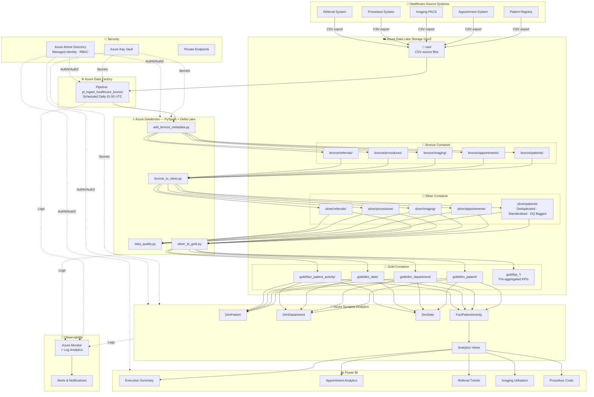
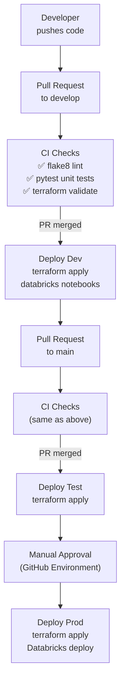
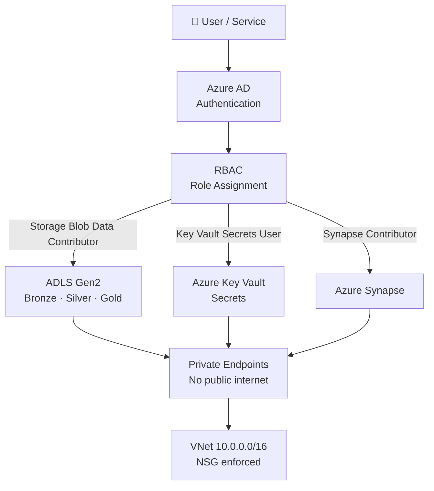
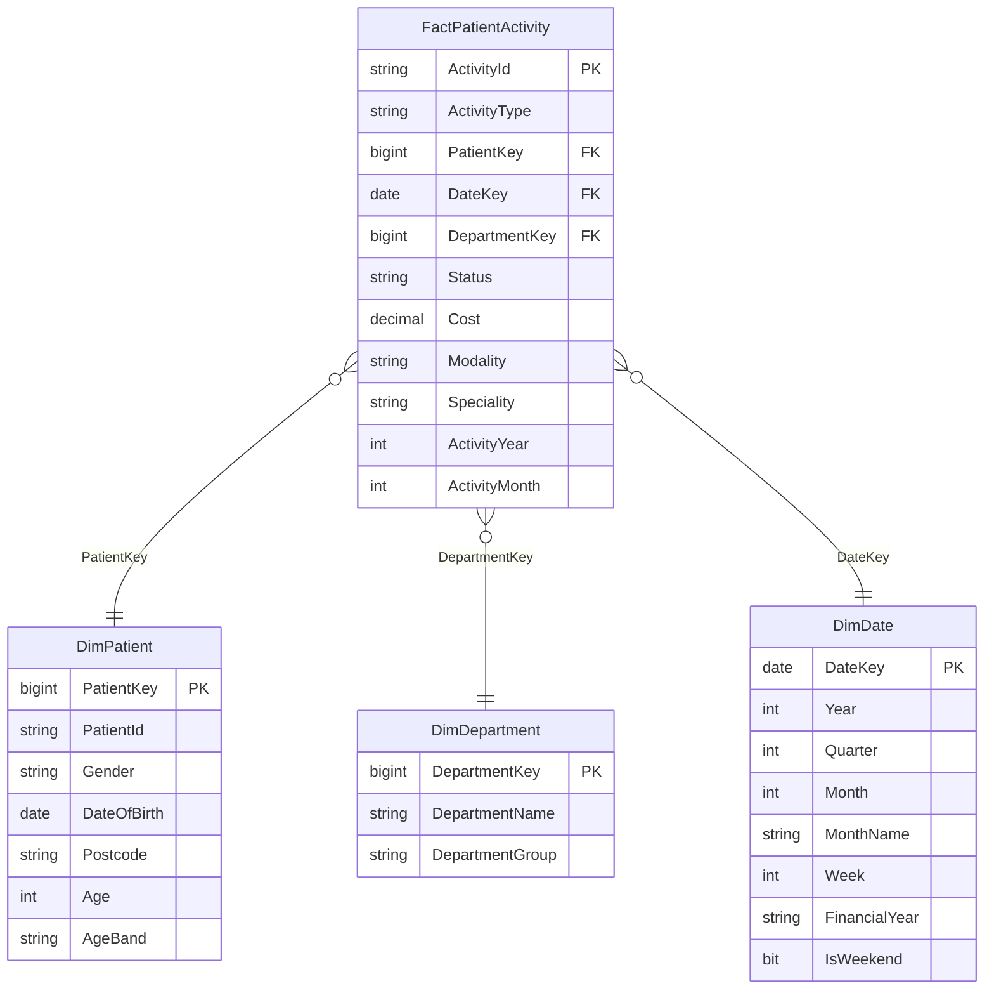

# Architecture Diagrams
## Azure Healthcare Analytics Platform

---

## 1. End-to-End Architecture



---

## 2. Medallion Architecture Data Flow

```mermaid
flowchart LR
    RAW["📁 Raw\nCSV files\nUnvalidated"] 
    -->|ADF Copy| 
    BRONZE["🥉 Bronze\nDelta Lake\nImmutable\n+ Audit columns\nAppend only"]
    -->|bronze_to_silver.py\nDeduplicate\nStandardise\nValidate| 
    SILVER["🥈 Silver\nDelta Lake\nCleansed\nDQ flags\nMERGE / upsert"]
    -->|silver_to_gold.py\nAggregate\nEnrich\nModel|
    GOLD["🥇 Gold\nDelta Lake\nFact + Dim\nKPI tables\nBusiness-ready"]
    -->|External tables|
    SYNAPSE["🔷 Synapse\nSQL Pool\nAnalytics views"]
    -->|DirectQuery / Import|
    PBI["📊 Power BI\nDashboards"]
```

---

## 3. CI/CD Pipeline



---

## 4. Security Model



---

## 5. Data Model (Star Schema)


